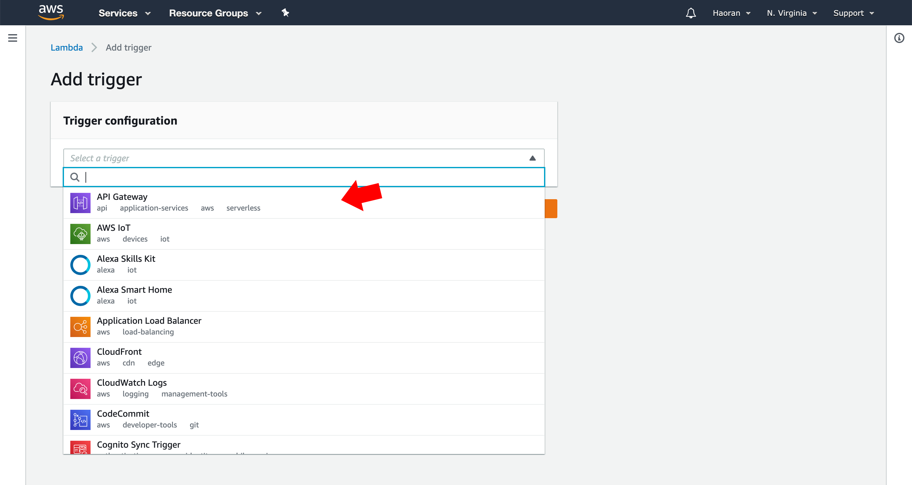
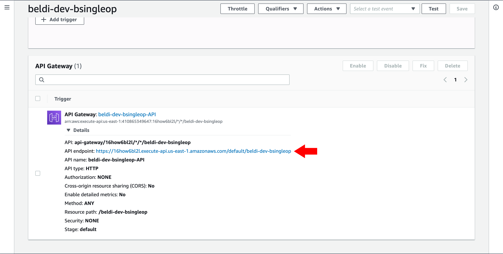

# Beldi

## Prerequisite

### install wrk
```
cd wrk2
make -j4
mv wrk ../tools/wrk
```

### Set up our docker container
```
$ docker login
```
If you're using github packages, run
```
$ docker run -it docker.pkg.github.com/eniac/beldi/beldi:latest /bin/bash
```
If you're using docker hub, run
```
$ docker run -it tauta/beldi:latest /bin/bash
```

The purpose of this container is to setup the environment needed to run 
our configuration, deployment, and graph plotting scripts. The actual
code of Beldi runs on AWS lambda.

> **The following operations should be done within the container.**

### Set AWS Credentials
```
$ aws configure
```
This will ask you for an access key ID, a secret access key, and 
region and output format. The first two can be found/created at:


set the region to `us-east-1` and the output format to `json`

## Running benchmark
### Notice
1. All scripts should be run at `~/beldi`
2. Try not kill the script halfway.
3. In some rare cases, it may take a long time for Dynamodb to delete a table.
If the script takes longer time than expected when starting up,
it is likely that it is waiting for deletion to finish first.
4. All benchmarks run on HTTP, so an HTTP endpoint has to be manually set up 
at AWS (we will show how to later).
5. Running our full end-to-end application experiments (Figures 12 and 13) 
will cost hundreds of dollars. To make it more manageable for others to 
reproduce our results, the provided script generates a single data 
point in the figure. We recommend using the default setting of 100 
requests/second.
6. Many of our scripts have two modes: fast and full. The fast mode takes
less time to complete but it is more approximate (it runs fewer iterations
of the experiment and relies on fewer data). The full mode runs the
same iterations that we report in our paper.

### Single Operation (Figure 11)
#### Time Estimation
The script has two modes
1. fast mode: less time, approximate result
2. full mode: full experiment

The script will ask you which mode to run when it starts.

1. fast: ~5 minutes
2. full: ~30 minutes

#### Running
```
$ pwd
/root/beldi
$ ./scripts/singleop/run.sh
```
Figure 11 includes three experiments, baseline (without beldi), 
beldi and beldi-txn. Their function names are bsingleop, 
singleop and tsingleop  respectively.

After deployment, the script will ask for the HTTP endpoint for these three 
lambdas, which need manual setup at AWS.

Take bsingleop as an example:

1. Go to the lambda console, click the function.


2. Click add trigger


3. Choose API Gateway


4. Configure as below


5. Click the trigger created


6. Copy the link and paste in terminal


After inputting all three endpoints, the experiment will start running.

The result will be saved at `~/beldi/result/singleop/singleop`, which can be 
loaded by gnuplot
```
$ gnuplot < scripts/singleop/singleop.pg
```
The figure will show up as `~/beldi/result/singleop/res.png`. You can 
use `docker cp` to copy it to your host.

### Garbage Collection Test (Figure 14)
#### Time Estimation
1. fast: ~30 minutes
2. full: ~2.5 hours

#### Note
Fast mode only runs 5 minutes for each experiment, so the generated figure is 
a prefix of the Figure 14 in our paper.

#### Running
```
$ ./scripts/gctest/run.sh
```
The script compiles and deploys the binary to AWS.

After that, it will ask for the HTTP endpoint for `beldi-dev-gctest`.

The result will be saved as `~/beldi/result/gctest/gc`

To generate the figure,
```
$ gnuplot < scripts/gctest/gc.pg
```
The figure will show up as `~/beldi/result/gctest/res.png`

### Movie Review (Figure 12)
#### Time Estimation
Each run (for the baseline and for Beldi) takes around 20 minutes

#### Baseline
```
$ ./scripts/media/run-baseline.sh
```
will run the experiment without `beldi`.

The script will first ask you for a request rate (the default is 100).
You can try a larger number if you have ample AWS credits and time.

After deployment, it will ask for the HTTP endpoint for `beldi-dev-bFrontend`.

When it finishes, it will print to terminal the median and p99 latency for 
100 requests/second. This result will also be saved 
to `result/media/baseline.json`.

Alternatively, you can view the metrics on AWS CloudWatch.

#### Beldi
```
$ ./scripts/media/run.sh
```

### Travel Reservation (Figure 13)
#### Time Estimation
Each run (for the baseline and Beldi) takes ~20 minutes

#### Baseline
```
$ ./scripts/hotel/run-baseline.sh
```
It will ask for the HTTP endpoint for `beldi-dev-bgateway`. (**NOT** beldi-dev-bfrontend)

When it finishes, it will print to terminal the median and p99 latency 
for 100 requests/second. It will also save the result to 
`result/hotel/baseline.json`.

#### Beldi
```
$ ./scripts/hotel/run.sh
```

## Cleanup
To avoid unexpected cost after the experiments are done:

1. Check the DynamoDB console and delete all tables if there are any left
2. Delete all lambdas, otherwise the garbage collector and intent collector
will continue to be triggered periodically.
(**DON'T** do this when running experiments).

## Trouble shooting
1. If deployment continues to fail, delete the stack at AWS CloudFormation and 
try again.
2. If the status of a table in DynamoDB remains `DELETING` for a long time, please wait until it finishes. We don't know a good way around it.
